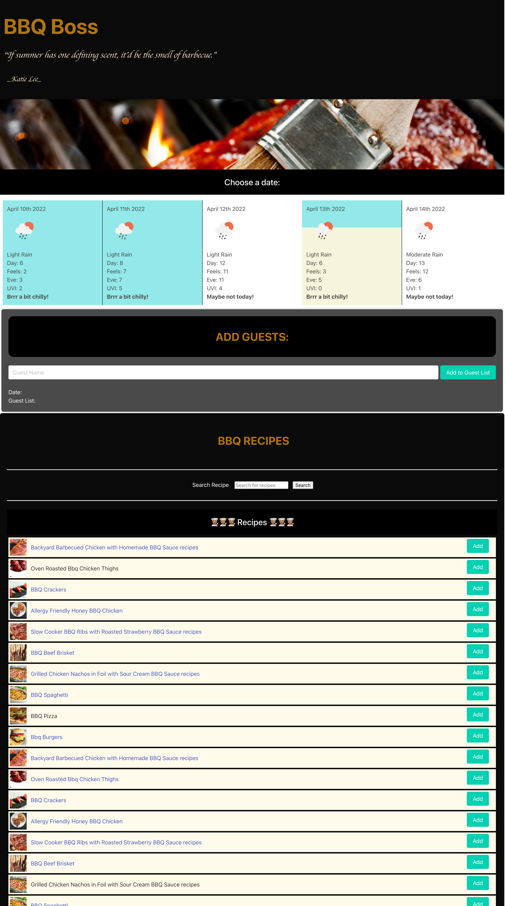
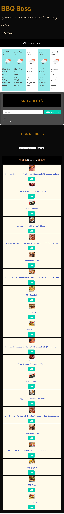
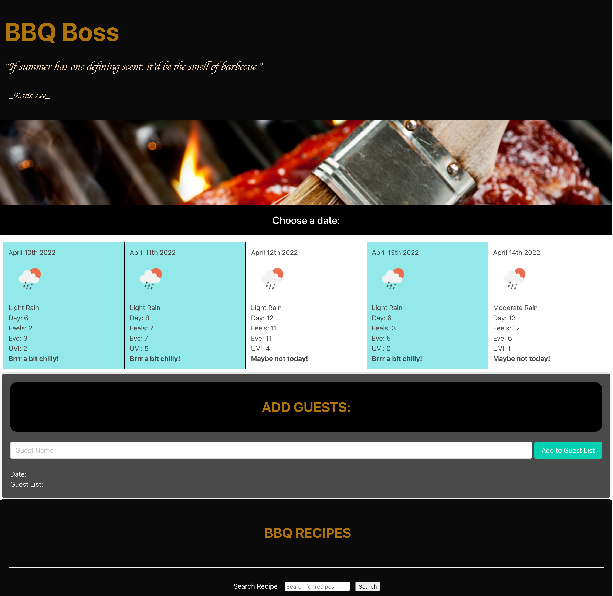

# BBQ Boss - Barbeque Event Organizer
Group Project - Nathan Smith, Tan Trung Nguyen, Phil McGarty

## About This Project

This project is a barbecue event organizer, which collates the pertinent information for hosting an event.

The user is greeted with a dashboard that displays the weather for the next few days - currently hardcoded to Ottawa, and a simple analysis of whether this would be a good day to host an outdoor barbecue party. This is indicated by the background color of the weather section - blue for too cold, yellow for moderate weather, and orange for a good day. The predominant weather for the day is also considered - raining, clear skies, etc - and a message is also displayed to further indicate if this would be a suitable day.
The user can click on one of the days and the date will be added to the form below.

The user also has the option to add guests to a simple guest list. One the user has entered the desired name in the text input box, the click the add guest button, and the name is added to the guest list on the below form.

At the bottom of the page is a recipe section which provides the host with ideas for recipes. This is set by default to display 10 "bbq" recipes. The user also has the option to search alternative recipes by using the search box, which will display 10 receipes related to their search. The user is presented with a photo of the dish, the title of the dish, and they can click the title, to be taken to the recipe instruction in a new browser window. If the user decides they want to use the recipe, then they can click the add recipe button, and it is added to the central form, along with the date and guests.

Once the user is happy with the information they have collated, they can choose to save the information to local storage by clicking the "save party" button.

With mobile browsing in mind, there is also the option to collapse the weather data, and recipe sections by clicking on the section headings.

## Screenshots

Desktop Site

Mobile Site

Site with collapsed accordion sections

## Future Development

This is the first version of the application, and as such there are several areas of potential improvement:
* Geocode the user's location, so the weather data is specific to where they are
* Option to remove guests from the central form
* Display more recipes
* Use the guest list to create invitations

## Links
[Project Code on Github](https://github.com/philmcgarty/bbq "Github")
[Deployed Site](https://philmcgarty.github.io/bbq)
